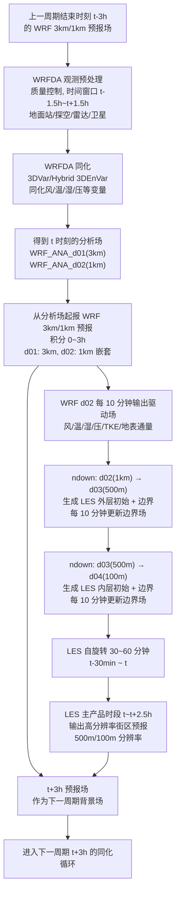
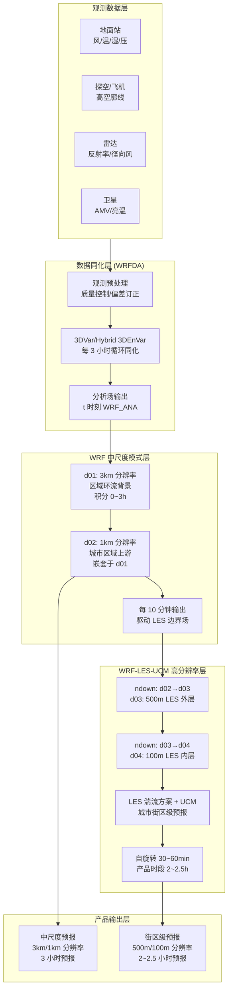

## WRFDA + WRF-LES-UCM 三小时循环同化技术路线与流程图

本文件给出在 **WRFDA + WRF-LES-UCM** 框架下，采用 **3 小时循环同化**、WRF（3 km 嵌套 1 km）与 LES（500 m 嵌套 100 m，10 分钟 `ndown` 驱动）的技术路线说明，以及对应的 Mermaid 流程图与技术路线图。你可以在支持 Mermaid 的环境中直接渲染这些图，也可以用项目中的 Node 脚本（`docs/render-mermaid-to-png.mjs`）导出 PNG。

---

### 一、技术路线总体说明

- **目标分辨率与时间尺度**
  - **WRF 中尺度：** d01 3 km + d02 1 km，积分时间步长满足稳定性要求，**每 3 小时做一次同化循环**，每周期积分 0–3 h。
  - **LES：** d03 500 m + d04 100 m，采用 LES 湍流方案 + UCM，**每 10 分钟通过 `ndown` 更新边界**，单周期内 LES 自旋转 30–60 min，之后 2–2.5 h 为高质量产品时段。

- **循环同化设计**
  - 以 **WRFDA** 在中尺度（3 km / 1 km）上做主循环；每 3 小时收集观测、质量控制、同化，生成分析场。
  - 用分析场起报 WRF 预报 0–3 h，期间高频输出驱动场，给 LES 提供边界条件。
  - LES 在每个周期内部完成 spin-up 和主预报时段，并输出 500 m / 100 m 的街区级结果。

- **观测与同化方案（建议）**
  - 观测来源：地面自动站、城市气象站、探空/飞机、雷达（径向风/反射率）、卫星（AMV、亮温等）。
  - 同化方法：推荐 **混合 3DEnVar 或 4DEnVar**；如算力受限，可先用 3DVar 过渡。
  - 周期：3 小时；时间窗口典型为 \[t−1.5 h, t+1.5 h]。

- **WRF 与 LES 耦合**
  - WRF d02（1 km）→ LES d03（500 m）：用 `ndown` 生成外层 LES 初始场和 10 分钟边界。
  - LES d03（500 m）→ LES d04（100 m）：继续用 `ndown` 或 WRF 嵌套机制生成 100 m 内层。
  - 确保垂直层次、物理参数化（特别是 UCM）在多尺度之间尽量一致。

- **准确性保障要点**
  - 高质量观测 + 严格 QC + 偏差订正。
  - 合理的背景误差统计（`gen_be` + 集合误差）与局地化、膨胀。
  - UCM 城市参数与真实城市几何、地表特性匹配。
  - WRF–LES 接口变量完备（风、温、湿、压、TKE、地表通量等），边界区采用平滑过渡。

---

### 二、单个 3 小时 DA 周期流程图（Mermaid）

描述从上一周期结束的 WRF 预报场，到当前周期 WRFDA 同化、WRF 预报、LES 驱动与产品输出，再到为下一周期提供背景场的完整闭环。

---

### 三、多周期技术路线图（Mermaid）

展示 Spin-up、多个 3 小时 DA 周期的连续演进，以及 WRF 与 LES 在时间轴上的协同。

```mermaid
flowchart LR
    S["长时间 Spin-up WRF<br/>12~24h 无同化<br/>调整土壤/城市能量平衡"] --> T0["首次分析起始时刻 t0<br/>WRF 状态作为背景场"]

    subgraph Cycle1["DA 周期 1 (t0~t0+3h)"]
      T0 --> A1["WRFDA 同化<br/>观测: 地面/探空/雷达/卫星"]
      A1 --> B1["WRF 3km/1km 预报 0~3h<br/>输出每 10 分钟驱动场"]
      B1 --> C1["LES 500m/100m 模拟<br/>ndown 驱动, 自旋转 30min<br/>产品时段: t0~t0+2.5h"]
      C1 --> D1["t0+3h WRF 预报场<br/>作为下一周期背景"]
    end

    subgraph Cycle2["DA 周期 2 (t0+3h~t0+6h)"]
      D1 --> A2["WRFDA 同化"]
      A2 --> B2["WRF 3km/1km 预报 0~3h"]
      B2 --> C2["LES 500m/100m 模拟<br/>产品时段: t0+3h~t0+5.5h"]
      C2 --> D2["t0+6h WRF 预报场"]
    end

    subgraph Cycle3["DA 周期 3 (t0+6h~t0+9h)"]
      D2 --> A3["WRFDA 同化"]
      A3 --> B3["WRF 预报 0~3h"]
      B3 --> C3["LES 模拟<br/>产品时段: t0+6h~t0+8.5h"]
      C3 --> D3["t0+9h WRF 预报场"]
    end

    subgraph CycleN["DA 周期 N (...)"]
      D3 --> AN["WRFDA 同化"]
      AN --> BN["WRF 预报 0~3h"]
      BN --> CN["LES 模拟"]
      CN --> DN["下一周期背景场"]
    end
```

---

### 四、系统架构示意图（可选，Mermaid）

从数据源到同化、WRF 中尺度、LES 高分辨率，再到产品输出的分层架构。

---

### 五、后续导出 PNG 的建议（不使用 Python）

- 你当前项目中已包含 Node 版本的 Mermaid 渲染脚本 `docs/render-mermaid-to-png.mjs`，可在有网络的环境下使用 **Node.js**（非 Python）调用在线 API，将 `.mmd` 或将本文件中的 Mermaid 代码复制到单独 `.mmd` 文件，然后：
  - 在 `docs` 目录下放置若干 `.mmd` 文件；
  - 运行命令（示例）：`node render-mermaid-to-png.mjs`；
  - 脚本会为每个 `.mmd` 生成同名 `.png`。

如需，我可以帮你把本文件中的每个 Mermaid 图拆成独立 `.mmd` 文件，方便你直接批量导出 PNG。

